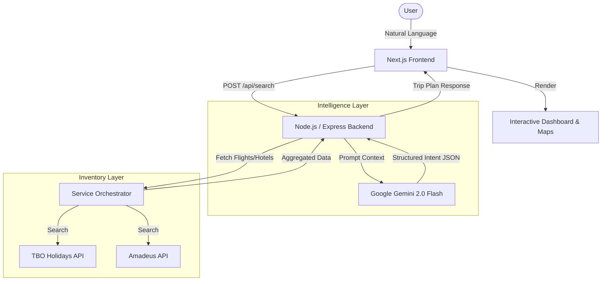

# SafarAI (Voyehack) - Project Information Master Document

**Date:** February 24, 2026
**Status:** In Development
**Version:** 1.0.0

---

## 1. Executive Summary

**SafarAI** is an advanced, AI-driven travel orchestration platform designed to streamline the complex process of trip planning. By leveraging **Google Gemini Generative AI**, SafarAI transforms natural language queries (e.g., "Plan a 3-day business trip to Mumbai") into actionable, real-time travel itineraries. It integrates seamlessly with live industry APIs (TBO, Amadeus) to provide accurate availability for flights, hotels, and activities, presenting them in a unified, interactive dashboard.

---

## 2. Problem & Solution

### The Problem
*   **Fragmentation:** Travelers switch between 4-5 apps to book flights, hotels, and cabs.
*   **Complexity:** Filtering through thousands of options is time-consuming.
*   **Lack of Context:** Standard search engines don't understand "romantic trip" vs. "budget backpacking."

### The SafarAI Solution
*   **Natural Language Processing:** Users speak or type their intent naturally.
*   **Contextual Intelligence:** The AI infers dates, traveler count, destination, and preferences.
*   **One-Stop Shop:** Flights, hotels, and map visualization are generated instantly in a single view.

---

## 3. Product Features

### Core Functionality
*   **Conversational Search:** Chat-based interface that remembers context.
*   **Interactive Maps:** Visualizes the entire trip on a map (flight paths, hotel markers).
*   **Dynamic Filtering:** Filters adapt based on the search results (e.g., specific airlines or hotel chains found).

### AI Capabilities
*   **Intent Extraction:** Extracts `Destination`, `Origin`, `Dates`, `Pax`, `Budget` from unstructured text.
*   **Smart Reasoning:** Explains *why* specific options were recommended (e.g., "Recommended because it's close to the city center").

---

## 4. System Architecture



---

## 5. Technology Stack

### Frontend
| Component | Technology | Description |
| :--- | :--- | :--- |
| **Framework** | Next.js 15 (App Router) | Server-side rendering, React 19 support. |
| **Language** | TypeScript | Type safety and better developer experience. |
| **UI Library** | Shadcn UI + Tailwind CSS | Fast, accessible, and customizable components. |
| **State** | Zustand | Lightweight client-side state management. |
| **Maps** | Leaflet / React-Leaflet | Open-source interactive maps. |

### Backend
| Component | Technology | Description |
| :--- | :--- | :--- |
| **Runtime** | Node.js | Non-blocking I/O for handling multiple API requests. |
| **Framework** | Express.js | Lightweight web server foundation. |
| **AI Model** | Gemini 2.0 Flash / 1.5 Flash | High-performance multimodal model. |
| **APIs** | TBO Holidays, Amadeus | Enterprise-grade travel inventory. |
| **Validation** | Zod (Implied) / Native | Request validation and error handling. |

---

## 6. Installation & Setup Guide

### prerequisites
*   Node.js v18+
*   NPM or Yarn
*   API Keys:
    *   Google Gemini API Key
    *   TBO API Credentials (Username/Password/Key)
    *   Amadeus Client ID/Secret

### Backend Setup
1.  navigate to `backend/`.
2.  Run `npm install`.
3.  Create `.env` file:
    ```env
    PORT=8000
    GEMINI_API_KEY=your_key
    TBO_USERNAME=your_user
    TBO_PASSWORD=your_pass
    ```
4.  Start server: `npm run dev`.

### Frontend Setup
1.  Navigate to `frontend/`.
2.  Run `npm install`.
3.  Start app: `npm run dev` (Runs on port 3000).

---

## 7. Folder Structure Overview

```
SafarAI/
├── backend/
│   ├── src/
│   │   ├── agent/       # AI Prompts & Tools
│   │   ├── routes/      # Express Routes (Search, Booking)
│   │   ├── services/    # External API Integration (TBO, Gemini)
│   │   └── index.js     # App Entry Point
│   └── data/            # Static Data (Cities, Activities)
│
└── frontend/
    ├── src/
    │   ├── app/         # Next.js Pages
    │   ├── components/  # React Components (FlightCard, MapView)
    │   └── lib/         # Utility functions
    └── public/          # Assets
```
